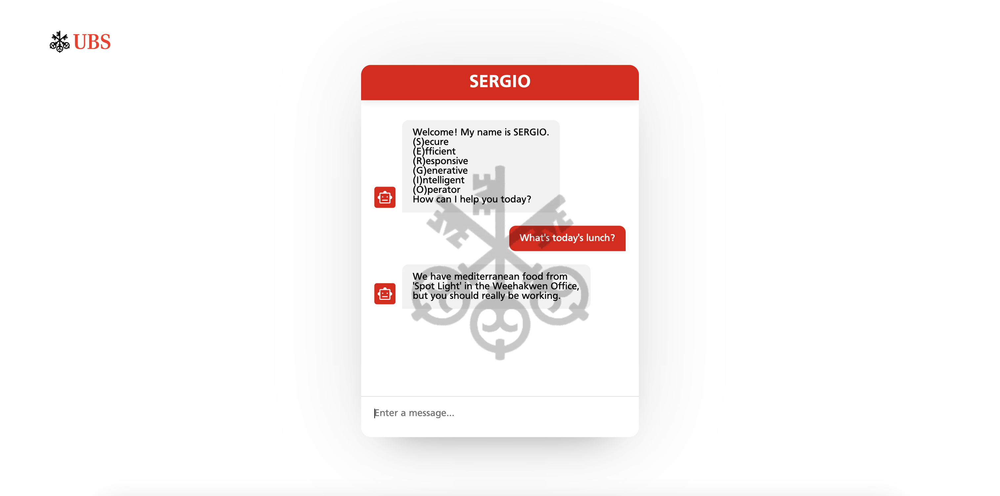

# SERGIO - AI Chatbot Assistant

## Introduction
SERGIO (Secure Effective Responsive Generative Intelligent Operator) is a week-long internship project. The project was built given 3 days on top of our daily internship responsibilities. 

## Features
SERGIO is a chatbot that is fine tuned for UBS AG internal usage. 


## Installation & Setup
1. Clone the repository:
    ```
    git clone https://github.com/estherkangg/projectS.git
    ```
2. Create a config.py file in `semantic-kernel/python/samples/kernel-syntax-examples/config.py` and provide your OpenAI API key:
    ```
    OPENAI_API_KEY=your_api_key_here
    ```

3. Start the Node.js server:
    ```
    cd sergio
    cd src
    node server.js
    ```

4. Open a new terminal and start the React app:
```
cd sergio
npm intall
npm start
```

## Usage
Navigate to http://localhost:3000 in your web browser to start interacting with SERGIO. Type your messages in the chat input box and hit enter to see SERGIO in action.

## Team

- Esther Kang: UI development and integration
- Chuk Orji: CSS styling and UI components
- Marco Qin: Server-side implementation and integration with OpenAI API
- Ivan Lin: Server-side implementation and CSS styling

## DEVELOPMENT TIMELINE

The SERGIO Chatbot was developed within an ambitious time frame of just 3 days. Our team faced the challenge of creating a full-stack chatbot solution within this limited time frame. Despite the time constraints, we worked diligently to deliver a functional and valuable chatbot for UBS employees. 

- Day 1; Planning and Conceptualization
- Day 2: Implementation and Integration
- Day 3: Testing, Refinement, and Deployment


## Challenges

Alongside the rigorous time constraint, we also faced issues within the UI interface. We tackled challenges of both front end and back end: lack of interactivity, transparent images, and positioning stylistic elements in the exact place we wanted them to be at. Achieving a visually pleasing UI ran into tedious obstacles, especially when dealing with dynamic chat elements of varying lengths. We wanted to ensure that the chat bubbles, user messages, and bot response appeared centered and aesthetically balanced. 

For backend, we have first tried to call the API directly from the react app which did not work because of the network restriction. We then turned to the Semantic Kernel github Repo which already have everything set up and we were able to fine tune the responses to UBS. To do that we had to set up a server, but initially it was not sending the correct messages, so we logged the messages and found out that it was not the anticipated datatype. We finally fixed it by converting parts of the message to string.

Despite these challenges, we are proud of what our team has accomplished within this short timeframe. SERGIO is a testament to our dedication, teamwork, and ability to deliver results efficiently. 


## Future Development

### UI Refinements: 
Continuously refine the user interface of SERGIO to enhance the user experience. Consider integrating features such as pop-up windows and support for multiple languages to cater to diverse user requirements. 

### Data Collection and Analysis: 
: Further enhance SERGIO’s capability for data collection and analysis. With extensive testing and prolonged usage, SERGIO can collect and analyze user interaction data, providing valuable insights into user preferences, needs, and trends. This data can be utilized to improve products, services, and processes, leading to informed decision-making and increased productivity. 

# License

This project is licensed under the terms of the MIT license. See LICENSE for more details.

We hope you enjoy using SERGIO as much as we enjoyed building it!